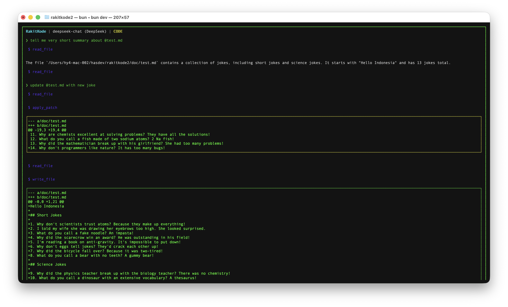

# RakitKode

**RakitKode** is a powerful AI Developer OS built for the modern terminal. It combines the intelligence of DeepSeek with a high-performance TUI (Terminal User Interface) to provide a seamless, interactive AI-driven development experience.



## 🚀 Key Features

- **TUI-First Experience**: Built with Ink/React for a modern, responsive terminal interface.
- **Unified Agent System**: Multi-agent orchestration (Planner, Coder, Reviewer, etc.) in a single loop.
- **Surgical Patching**: Intelligent diff-based editing—never overwrites your entire file unnecessarily.
- **Human-in-the-Loop**: Full control via `Accept`, `Reject`, and `Accept All` diff management.
- **YOLO Mode**: Need speed? Enable `/yolo` to let the AI apply changes autonomously.
- **Search & Navigation**: Integrated `grep`, `symbol_search` (AST), and file system tools.

## 🛠 Tech Stack

- **Runtime**: [Bun](https://bun.sh)
- **Agent Framework**: Custom Agentic Loop with DeepSeek/OpenAI support.
- **UI**: [Ink](https://github.com/vadimdemedes/ink) (React for CLI)
- **Database**: Bun SQLite (Search index & Context memory)

## 📦 Getting Started

### Installation

```bash
bun install
```

### Configuration

Add your DeepSeek API key to your environment:

```bash
export DEEPSEEK_API_KEY=your_key_here
```

### Usage

Run RakitKode:

```bash
bun run dev
```

### TUI Commands

- `/yolo` - Toggle auto-approve mode
- `/diff` - Show pending patches
- `/files` - Show list of modified files
- `a` / `r` - Accept or Reject changes
- `/clear` - Clear terminal screen
- `/exit` - Exit RakitKode

## 📄 License

MIT © RakitKode Team
